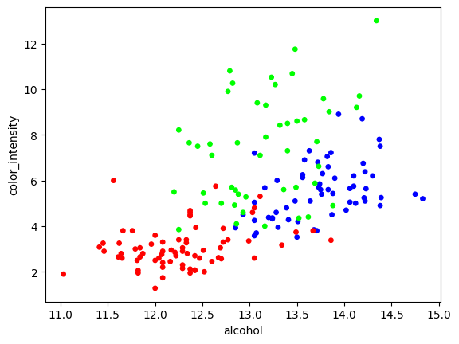
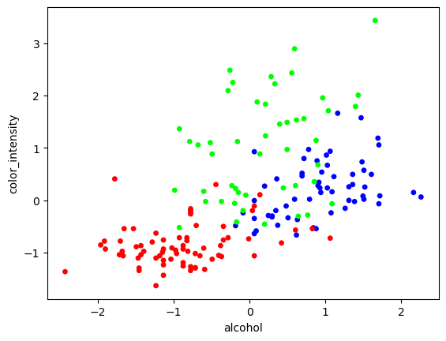
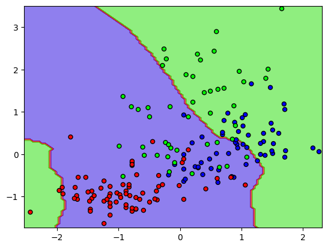
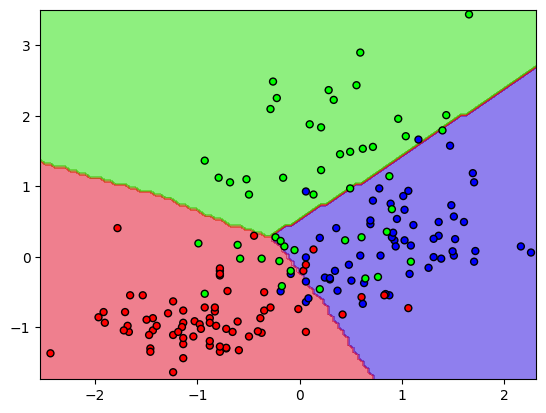

# PyTorchDL

| :placard: Vitrine.Dev |     |
| -------------  | --- |
| :sparkles: Nome        | **Deep learning with Pythorch**
| :label: Tecnologias | Python, GoogleColab, Jupyter Notebook, Pandas, PyTorch  (tecnologias utilizadas)
| :fire: Desafio     |  https://cursos.alura.com.br/course/pln-deep-learning

  
  
  
  

O machine learning tradicional tem duas etapas. A etapa de extração de características, onde o programador diz quais características são relevantes. No caso do cachorro eu posso procurar por pontas de orelha, por círculos, equivalente aos olhos. E aí eu vou treinar um modelo de classificação provavelmente, que não precisa ser rede neural, pode ser qualquer outro modelo, que vai me dizer que isso é um cachorro.

Só que o que eu faço com o deep learning é as duas coisas ao mesmo tempo, eu crio uma rede profunda que vai aprender características e treinar um modelo de inferência ao mesmo tempo. Portando, é isso que é o deep learning: o aprendizado de características para realizar inferências.Deep learning, porque a modelagem hierárquica, o aprendizado profundo permite a construção de modelos mais robustos e mais complexos.

Pytorch é uma biblioteca Python para computação científica. Inclusive é uma das mais utilizadas para pesquisa científica quando se trata de deep learning. O slogan deles é “Da pesquisa para produção”.
# CNN PYTHORCH

